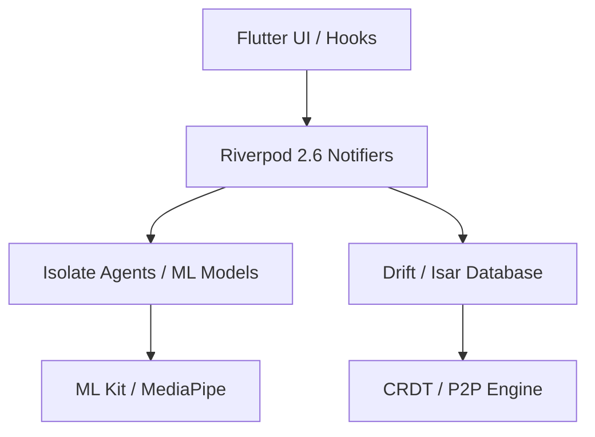

<div align="center">
  

  <h1>🦅 PennyPilot</h1>
  <p><b>Sovereign Personal Finance. Engineering Privacy through Local Intelligence.</b></p>

  <div>
    
    
    
    
  </div>

  <br />

  <p>
    <i>"Your financial life belongs to you. Not the cloud. Not the data brokers."</i>
  </p>
</div>

---

## 💎 The Sovereign Manifesto

In an era of surveillance capitalism, PennyPilot is a rejection of the baseline. We believe that managing your wealth shouldn't require surrendering your identity. 

**PennyPilot** is a local-first, privacy-engineered financial co-pilot. We have inverted the traditional AI model: instead of sending your sensitive data to the AI in the cloud, we bring the AI directly to your data, on your hardware.

---

## ⚡ Core Pillars

### 🧠 Forensic Intelligence
*   **On-Device OCR & LLM**: Utilizing **Google ML Kit** and **MediaPipe**, PennyPilot extracts dates, merchants, and itemized tables from receipts without an internet connection.
*   **Forensic Parsing**: A proprietary system prompt architecture converts messy OCR noise into structured JSON with 90%+ confidence.
*   **Subscription Detection Agent**: An ML-driven clustering engine that identifies "Zombie Subscriptions" and price hikes before they hit your balance.

### 🛡️ Hardened Privacy
*   **Zero-Knowledge Storage**: Data is persisted in an **Isar** NoSQL database with hardware-level encryption. 
*   **The Nuclear Option**: Instantly wipe all cryptographic keys and local databases via a dedicated security barrier.
*   **Biometric Sentinel**: Secured by industry-standard FaceID, TouchID, and Fingerprint sensors.

### 🔄 Local-First Sync
*   **CRDT-Based Engine**: Conflict-free Replicated Data Types ensure your data remains consistent across devices without an intermediary server.
*   **P2P WebRTC**: Cross-device synchronization happens directly over local networks—zero data ever touches a server.

---

## 🛠️ The Sonar Architecture

PennyPilot is built on the **Sonar Architecture**, prioritizing 100% type-safety and reactive state management.



---

## 🚀 Tech Stack

| Layer | Technology | Philosophy |
| :--- | :--- | :--- |
| **Foundation** | **Flutter 3.38+** | Native performance across Mobile, Desktop, and Web. |
| **Logic** | **Riverpod 2.6** | Functional, compile-safe state with `AsyncNotifier`. |
| **Intelligence** | **MediaPipe / TFLite** | High-performance inferencing for Gemma 2B models. |
| **Persistence** | **Isar / Drift** | Type-safe, ACID-compliant local-first storage. |
| **Motion** | **Rive** | High-fidelity vector animations for interactive dashboards. |

---

## 🏗️ Getting Started

### 1. Prerequisites
- **Flutter SDK** (Channel Stable, >3.38)
- **Android Studio / Xcode** for platform tooling

### 2. Installation
```bash
# Clone the repository
git clone https://github.com/Its-Juice/PennyPilot.git

# Initialize dependencies
flutter pub get

# Generate type-safe models & providers
dart run build_runner build --delete-conflicting-outputs
```

### 3. Localization
PennyPilot is multilingual by design. To generate current strings:
```bash
flutter gen-l10n
```

---

## 🤝 Contributing

We welcome architects, designers, and privacy advocates.

1.  **Fork** the core.
2.  Create a **Feature Branch** (`feat/quantum-encryption`).
3.  Ensure **`flutter analyze`** returns zero warnings.
4.  Commit using **Conventional Commits**.

---

<div align="center">
  <p><i>Fly your finances safely. Built with ❤️ for the Sovereign Community.</i></p>
  
</div>
